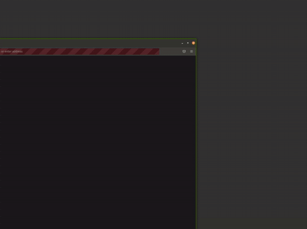
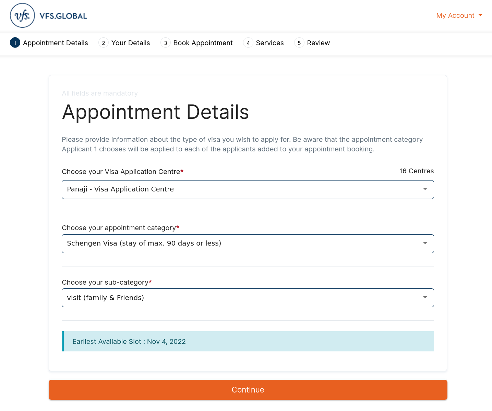
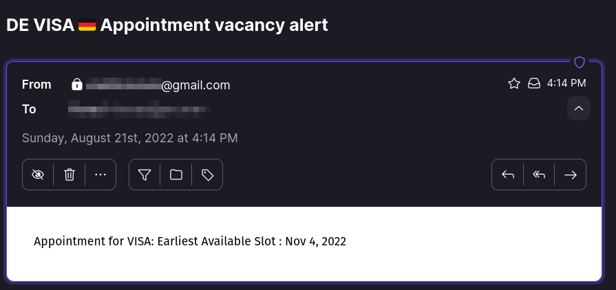
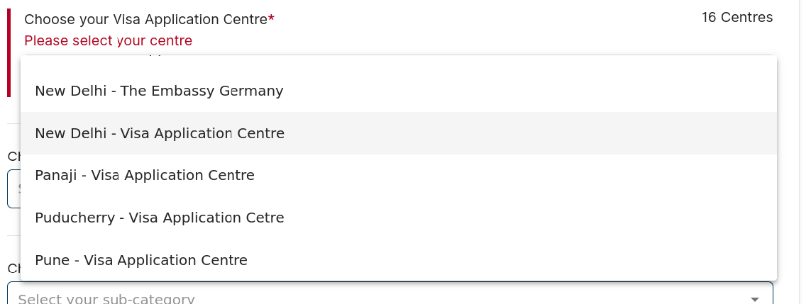
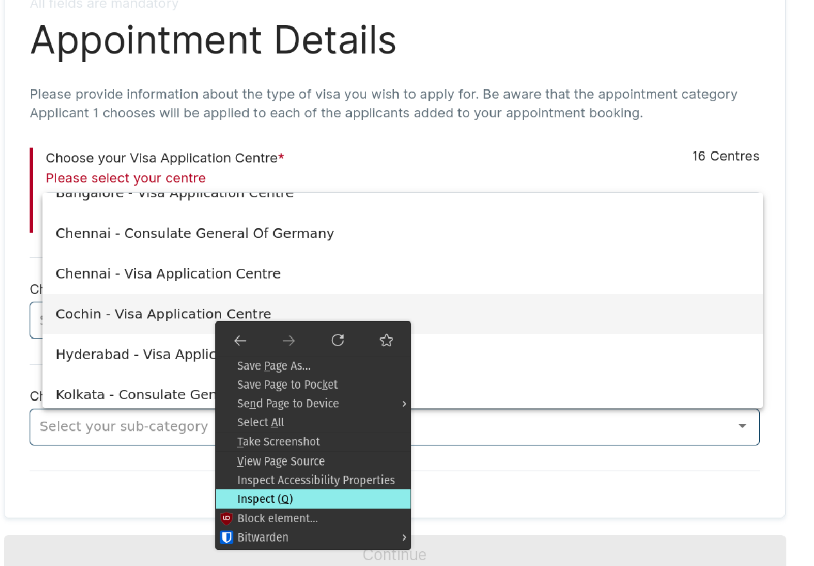

# German VISA Appointment Vacancy Finder

This application automates looking for a particular type of German 🇩🇪 VISA appointment for Indian 🇮🇳 citizens with selenium. It was written mostly to suit my needs but is easily configurable.
It repeatedly checks for the appointment with some delay. When it finds an appointment, it sends an alert via your GMail to your preferred recipient so that they can book an appointment as soon as possible.

## Demo


### Success

when appointment is found, send an email


## Setup
1. create/login to gmail account and [create a new app password](https://www.lifewire.com/get-a-password-to-access-gmail-by-pop-imap-2-1171882) for our app
2. create an account at [VFS](https://visa.vfsglobal.com/ind/en/deu/register) if you haven't yet done so.
3. fill in the values in the `.env` file which would contain important credentials such as:
    - username, password for logging into the VFS site
    - sender's & receiver's email id (to send the alert)
    - app password generated above.

   Here's how a sample `.env` file looks like:
   ```
   VFS_USERNAME='max_mustermann@gmx.de'
   VFS_PASSWORD='...'
   ...
   ```
4. Install dependencies.
    - `conda env create -f env.yml`
5. Activate conda environment: `conda activate visa`
6. run `python appointment_finder.py &`
    - this would run in the background and sends an alert when an empty slot is found, containing the date of the available appointment.
    - sometimes, it might happen that you're busy and didn't notice your email and by the time you do, the slot was taken. 
      Hence, this script keeps on running even after finding an appointment (after waiting for a few minutes), so that it keeps checking for new slots all the time.
      When you're finally done, do `kill %1` to stop the python program.

### Assumptions
This applications needs [Firefox](https://www.mozilla.org/en-US/firefox/new/) browser and [geckodriver](https://www.guru99.com/gecko-marionette-driver-selenium.html). It is assumed that the user already has these installed.

## VISA type Configuration
This application by default looks for `Schengen VISA` for `family & friends` at `New Delhi - Visa Application Center`. If you want to change it, then before running this application, do the following:
1. login to the website manually and click on `New Booking`.
2. In the three drop down menus that are shown, the first one contains the list of visa application centers.
    
    At the time of writing this, there're 16 centers.
3. Before you select your visa application center, right click on it & select `inspect`
    
    This would open the inspection tool in the browser below.
    
    Right click on the highlighted line & Copy the `XPath`.
4. Replace the option value in the `find_appointment_info` function in the code. These are simply a few items in the list. _New Delhi_ is at `12th` position in the list whereas _Cochin_ is at `6th` position.

    E.g., for _Cochin_, the `XPath` would be `.../mat-option[6]/span`. So replace `12` (New Delhi) in the original code with `6`.
5. Do the steps `3-4` for other two drop down menus if they're different from the defaults.
6. Follow the instructions in `setup` above.


Good Luck!
